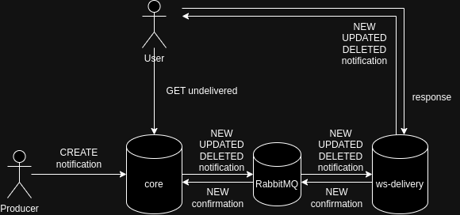

# Tom-Notifier
A system designed to reliably deliver notifications to users.

System consists of two servers: `tom-notifier-core` and `tom-notifier-ws-delivery`. Each of them is described in their owns README.md.

`tom-notifier-core` allows to create/update/delete notifications and keeps track
of notifications that have not been delivered yet. Creating/updating/deleting
notification pushes a [message](./shared/protobuf/rabbitmq_notification.proto)
to RabbitMQ so it can be observed by any intrested party. Since application
keeps track of undelivered notifications it is possible to mark notification as delivered
by passing [confirmation](./shared/protobuf/rabbitmq_confirmation.proto) to RabbitMQ.

`tom-notifier-ws-delivery` passes any update of the notification to users connected
by websockets. Any user can be connected with many devices and each of them will
receive notification update. Server makes sure client have seen a message by requiring
him to respond to every message. Message is resent periodically until it is responded
to or resend limit has been reached (at this time connection is considered unresponsive
and closed). User response to **NEW** message creates a confirmation that is send to
RabbitMQ so `tom-notifier-core` can mark notificaton as delivered.

Both of the servers were written with scalability in mind so creating multiple instances
of each of them will work as intended.


### How does it work?
Producer creates notifications using HTTP. 
Notifications are created in state `undelivered` and they are pushed to RabbitMQ


Users can fetch all undelivered notifications from `tom-notifier-core`


At this point all undelivered notifications change state to `delivered`.
In delivered state, notifications can be updated or deleted. Whenever they are,
message is published to RabbitMQ.

To avoid unnecessary long polling each notification status change (NEW/UPDATED/DELETED)
is published to RabbitMQ. `tom-notifier-ws-delivery` consumes those messages
and forwards them to connected users.


User needs to send response to any received message.
Response mean user have received and processed the message.
Not responding to message will eventually lead to closing connection because server
marks connection as unresponsive after reaching maximum retry count.

Responding to NEW notification publishes confirmation to RabbitMQ so `tom-notifier-core`
can change notification state to `delivered`.




`tom-notifier-ws-delivery` can detect issues related to RabbitMQ connection.
Whenever they happen all connected users are informed about it so they can switch
to long polling `undelivered` notifications from `tom-notifier-core`.
After recovering connection with RabbitMQ `tom-notifier-ws-delivery` sends information
to the users they can stop using long polling and can rely on websockets again.

### Notes
Websocket connection only forwards notifications state changes that happended
after establishing connection. It means user should first establish websocket connection with `tom-notifier-ws-delivery`, then fetch all `undelivered` notifications
from `tom-notifier-core` and from this point user can rely on websocket connection.

Format of `notifications` and `confirmations` published to RabbitMQ as well
as `notifications` and `responses` sent between users and `tom-notifier-ws-delivery`
is written in [shared/protobuf](./shared/protobuf/).

## How to run
Servers can be started by running following command:
```
docker compose up --build --detach
```

## How to run tests
Before running tests start servers.
Now navigate to project of interest (`tom-notifier-core`, `tom-notifier-ws-delivery`, or any crate located in shared directory) and run following command:
```
cargo test
```
